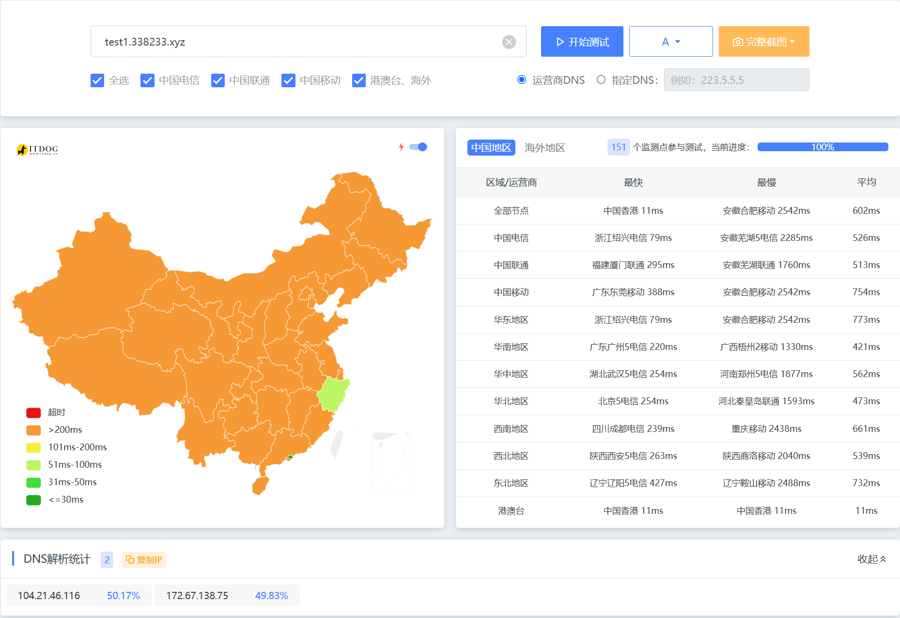
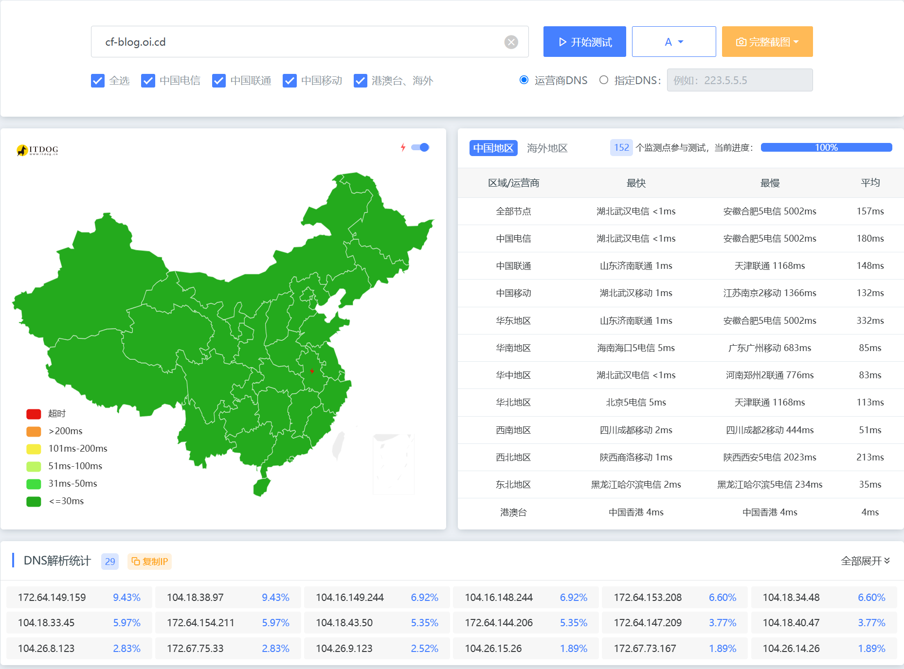
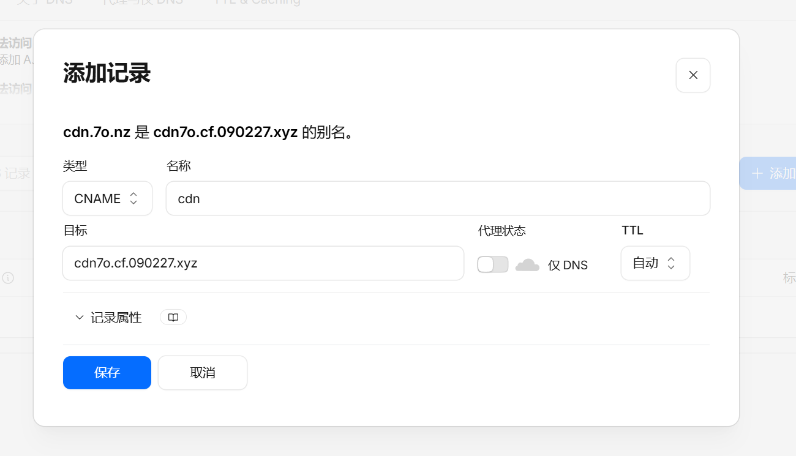
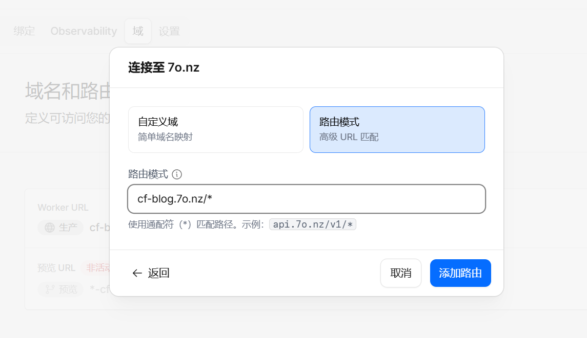
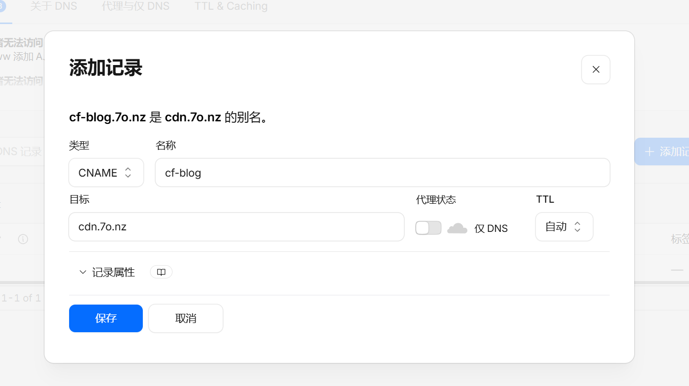

优选前：

优选后：


## 优选原理

简单说，Cloudflare 的小黄云会同时托管两件事——DNS 解析层和路由规则层；只要开启小黄云，你就没法单独改解析、指向更快的节点。而 Worker 路由的出现，让规则层和解析层都可以自己配置，这就是优选能落地的关键。

> [!NOTE] [原文：#优选原理 - 二叉树树](https://2x.nz/posts/cf-fastip/#优选原理)
> 首先我们要知道 CDN 如何为不同域名分发不同内容。
> 
> 可以将其抽象为两层：**规则层**和**解析层**。当我们普通地在 Cloudflare 添加一条开启了小黄云的解析，Cloudflare 会为我们做两件事：
> 
> - 写一条 DNS 解析指向 Cloudflare
> - 在 Cloudflare 创建一条路由规则
> 
> 如果想要优选，实际上就是手动更改这条 DNS 解析，使其指向一个更快的 Cloudflare 节点。但一旦关闭小黄云，路由规则也会被删除，再访问就会变成 DNS 直接指向 IP——也就用不了了。
> 
> **而 Worker 路由让自定义成为可能。**
> 
> 创建 Worker 路由规则（规则层）后，DNS 解析（解析层）就可以任意指向优选节点。这两件事都可以自己来做，不再依赖小黄云。
> 
> 这就是经由 Worker 路由的流量能做优选的原因。

## 选择优选域名

优选的核心就是选择一个国内访问速度更快的Cloudflare节点IP或域名。

常用的社区优选域名：[https://cf.090227.xyz](https://cf.090227.xyz)

这些优选域名通常是通过扫描Cloudflare官方IP段，找出国内延迟最低的IP整理而成。

### 使用优选域名

直接使用 [https://cf.090227.xyz](https://cf.090227.xyz)，官方推荐优先使用自定义前缀的泛域名，例如 `123.cf.090227.xyz`。

随后在你的域名 DNS 记录里添加一条 CNAME 记录，**不要开启小黄云**。



之后想给其他站点也用这个优选，把站点 CNAME 解析到上面配置好的 `123.cf.090227.xyz` 即可。

## 各类优选方案

### Page/Worker 项目优选

如果你需要优选 Page/Worker 项目，首先，如果你的项目是 Pages，需要先在 Pages 项目设置里迁移到 Workers。

接下来配置 Worker 路由：选择你的域名，路由模式填写 `你的域名/*`（例如 `cf-blog.7o.nz/*`）。



最后写一条 DNS 解析到上面配置的优选域名即可。



### Worker 路由反代全球并优选

> 本方法的原理是通过 Worker 反代源站，然后对 Worker 的入口节点做优选。这不是传统意义上的优选——源站收到的 Host 头仍是源站域名，所以源站不需要为优选域名额外配置 SSL/路由。

> 本方案可以优选Vercel，只需要将Vercel提供的域名填写进下面的配置即可。

点击计算 --> Wokers 和 Pages 创建应用程序 --> 从Hello Word!开始 --> 修改Worker name --> 点击部署 --> 右上角点击编辑代码，将下面代码粘贴进去，随后点击部署。

详情见下图：


```javascript

// 域名前缀映射配置
// 示例：'cf-blog.7o.nz': 'cf-blog.'
// 则 Worker 路由 cf-blog.* 都会反代到 cf-blog.7o.nz
const domain_mappings = {
  '源站.com': '最终访问头.',
};

addEventListener('fetch', event => {
  event.respondWith(handleRequest(event.request));
});

async function handleRequest(request) {
  const url = new URL(request.url);
  const current_host = url.host;

  // 强制使用 HTTPS
  if (url.protocol === 'http:') {
    url.protocol = 'https:';
    return Response.redirect(url.href, 301);
  }

  const host_prefix = getProxyPrefix(current_host);
  if (!host_prefix) {
    return new Response('Proxy prefix not matched', { status: 404 });
  }

  // 查找对应目标域名
  let target_host = null;
  for (const [origin_domain, prefix] of Object.entries(domain_mappings)) {
    if (host_prefix === prefix) {
      target_host = origin_domain;
      break;
    }
  }

  if (!target_host) {
    return new Response('No matching target host for prefix', { status: 404 });
  }

  // 构造目标 URL
  const new_url = new URL(request.url);
  new_url.protocol = 'https:';
  new_url.host = target_host;

  // 创建新请求
  const new_headers = new Headers(request.headers);
  new_headers.set('Host', target_host);
  new_headers.set('Referer', new_url.href);

  try {
    const response = await fetch(new_url.href, {
      method: request.method,
      headers: new_headers,
      body: request.method !== 'GET' && request.method !== 'HEAD' ? request.body : undefined,
      redirect: 'manual'
    });

    // 复制响应头并添加CORS
    const response_headers = new Headers(response.headers);
    response_headers.set('access-control-allow-origin', '*');
    response_headers.set('access-control-allow-credentials', 'true');
    response_headers.set('cache-control', 'public, max-age=600');
    response_headers.delete('content-security-policy');
    response_headers.delete('content-security-policy-report-only');

    return new Response(response.body, {
      status: response.status,
      statusText: response.statusText,
      headers: response_headers
    });
  } catch (err) {
    return new Response(`Proxy Error: ${err.message}`, { status: 502 });
  }
}

function getProxyPrefix(hostname) {
  for (const prefix of Object.values(domain_mappings)) {
    if (hostname.startsWith(prefix)) {
      return prefix;
    }
  }
  return null;
}

```


随后参考 [Page/Worker 项目优选](#pageworker-项目优选) 进行配置即可


## 最后

CloudFlare 的优选方案还有很多，外域优选、CloudFlare Tunnel 优选、CloudFlare R2 优选等，请点击[这里](https://2x.nz/posts/cf-fastip/#各类优选方案)查看更多。

- 图文：[试试 Cloudflare IP 优选！让 Cloudflare 在国内再也不是减速器！ - 二叉树树](https://2x.nz/posts/cf-fastip/)
- 视频：[全网最全 CF 优选全解（B 站）](https://www.bilibili.com/video/BV1QpSoBqERj)

## 编辑建议

> 以下建议基于本条目内容生成，仅供发布前参考。

### 文章内容建议
- 建议补充"优选域名的选取标准"小节：当前直接推荐 `cf.090227.xyz` 但没讲这个域名是社区谁维护的、IP 来源是什么、更新频率如何；建议补充"如何自己用 `better-cloudflare-ip` 或 `CloudflareScanner` 跑一份本地区域的优选 IP 列表"。
- 建议补充"Worker 反代的缓存策略"：第四章 `cache-control: 'public, max-age=600'` 写死 600 秒，对动态内容（如 Vercel SSR 页面）可能不合适；建议拆分为按 URL 模式设置不同 max-age，或直接 `no-cache`。
- 建议补充"安全风险"小节：直接暴露 Worker 路由 + 自定义 DNS 解析后，源站可能收到非 Cloudflare 边缘节点的 IP 直连（绕过 WAF）；建议补一句"源站应设置 Cloudflare Authenticated Origin Pulls 或 IP 白名单"。
- 建议补充"实测对比"：第 14-18 行只贴了 ITDOG 截图，没给具体"优选前 X 节点 / 优选后 Y 节点"对比数据；建议补一两句量化结论。

### 修改建议
- 文首 image 路径 `./images/PixPin_2026-06-13_21-00-11.webp` 用了 PixPin 截屏软件默认命名前缀，建议重命名为更语义化的 `cf-fastip-before-after.webp`（与 `eo-cdn-use-738037.webp` 等命名风格一致）。
- description "通过 Worker 反代为网站做 IP 分流优选，提高国内访问速度与可用性"过于笼统，建议改为"通过 Cloudflare Worker 路由与社区优选域名结合，为 Pages/Worker/Vercel 站点实现国内访问加速"。
- 第四章 Worker 代码 `domain_mappings` 注释 `'源站.com': '最终访问头.'` 中 `'源站.com'` 是占位符易误导，建议改为明显占位如 `<源站域名>` 或具体示例域名。
- 分类 `技术` 与新的 7 分类不匹配（无对应），建议改为"网络"。

### 合并建议
- 候选合并对象：`eo-cdn-use`（国内访问加速主题）
- 合并理由：可合并为"国内访问加速：CDN 切换与 CloudFlare 优选"系列；或保留独立并在文末"## 相关阅读"加链接。
- 候选合并对象：`zerotier-private-planet-setup`（自建网络加速）
- 合并理由：可加跳转链接，形成"访问加速/内网穿透"系列阅读路径。

### slug 建议
- 当前：`cf-fastip`
- 建议：保留
- 理由：slug 简洁且命中 CloudFlare 缩写 + 优选动作（fastip），可搜索性极强；可改为 `cloudflare-fastip-guide` 更正式但当前已足够。

### 分类建议
- 建议归类到：网络
- 理由：CloudFlare 优选本质是国内访问网络加速，属典型网络主题；当前 `技术` 过于宽泛。

### tags 建议
- 建议：`[CloudFlare, CDN]`
- 与现状对比：`[CloudFlare]`，差异说明：当前仅一个 tag 过少，建议补充 `CDN` 主题词与文章"国内 CDN 加速"主题对齐。

### 其他建议
- 建议补充配图：第四章 Worker 反代前后 source IP 抓包截图（用 `curl -v` 对比 origin 收到的 IP 是不是 CloudFlare 节点）、DNS 解析 `dig 123.cf.090227.xyz` 结果截图。
- 建议在文首加"## 风险与免责"小段：优选使用第三方维护的 IP/域名稳定性不可控，建议在生产环境自己维护 IP 列表。