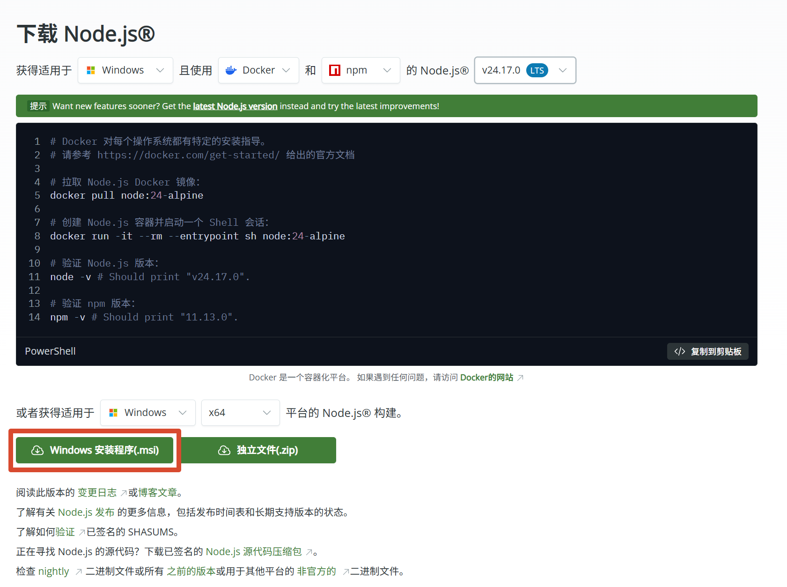
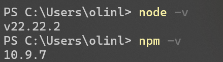
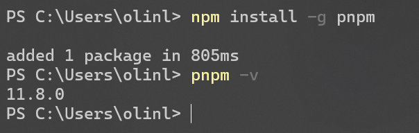
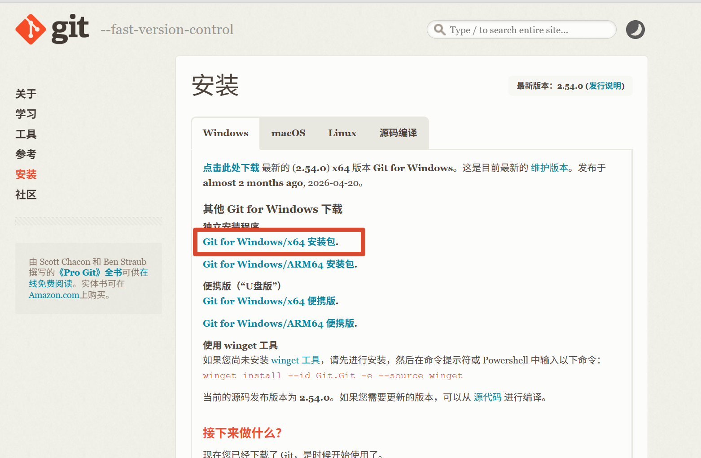
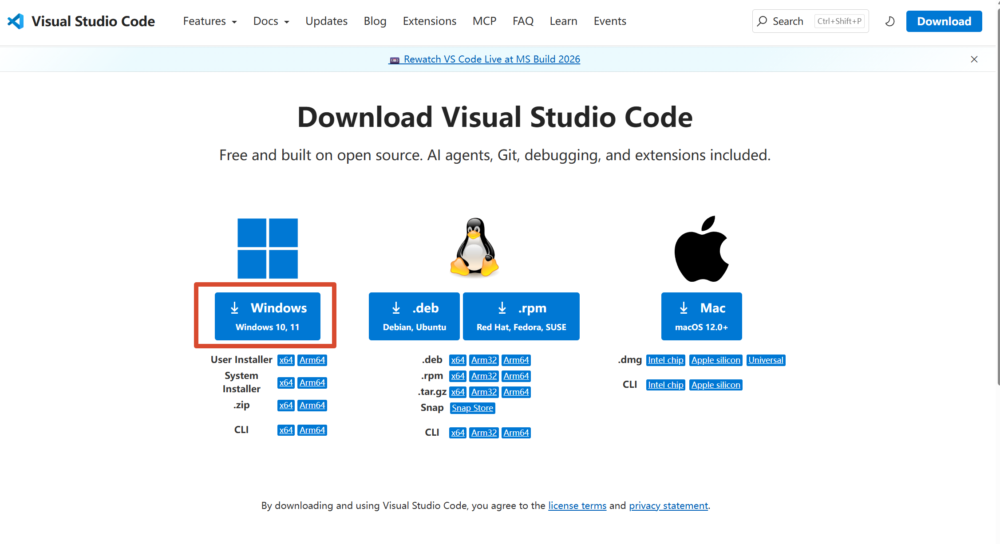
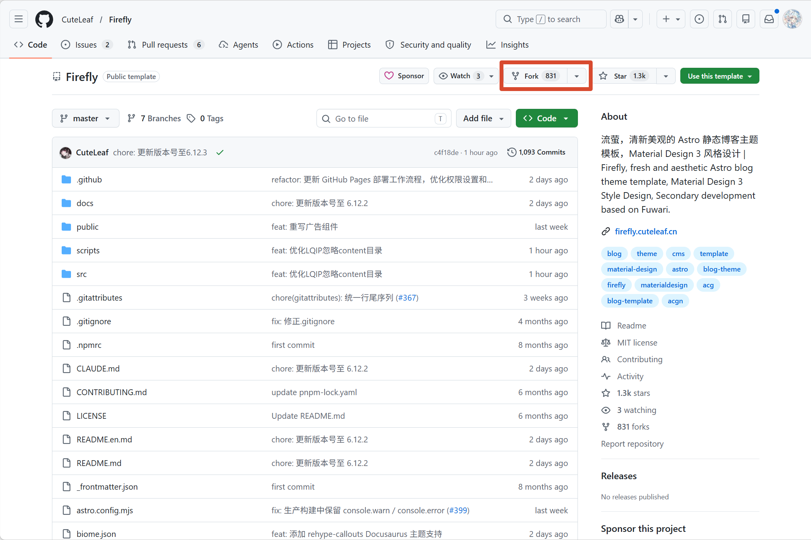
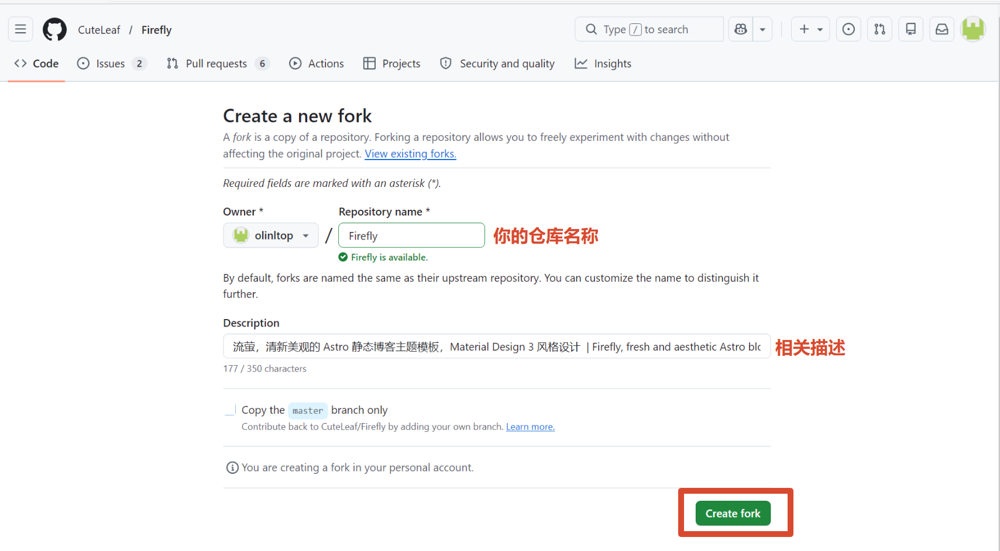
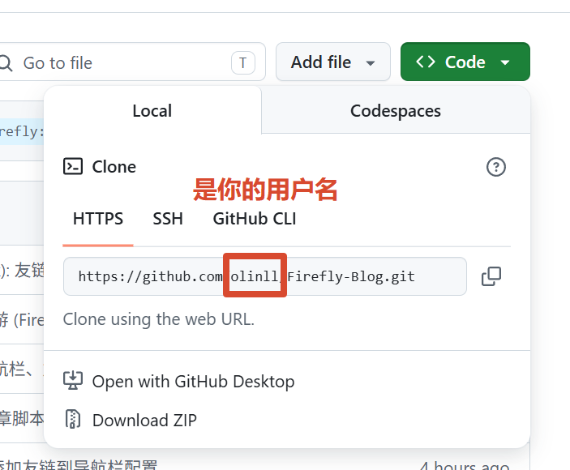

## 一、前置准备

- 一个域名，无需备案、可使用二级域名。
- Windows 电脑
- [Github](https://github.com) 账号，用于托管源码  没有的可以自己注册一个
- [Cloudflare](https://www.cloudflare-cn.com/personal/) 账号，用于托管你的站点，自动拉取Github源码部署

> [!CAUTION] 注意
>
> 部分情况可能需要特殊的网络环境，如无法正常访问请尝试更换网络环境。

### 安装必备环境

- [Node.js](https://nodejs.org/)：关键运行环境
- pnpm：包管理工具，使用npm进行安装。
- [Git](https://git-scm.cn/)：版本控制，用于拉取、提交代码。
- [GitHub Desktop](https://desktop.github.com/download/) github官方客户端
- [VS Code](https://code.visualstudio.com)：编辑器，用于修改配置、写文章。

#### 安装Node.js

这里推荐安装**LTS**稳定版，版本需要 ≥ 22

可以点击链接进行下载：[Node.js v24.17.0 LTS](https://nodejs.org/dist/v24.17.0/node-v24.17.0-x64.msi)

或者打开下载页面手动下载：https://nodejs.org/zh-cn/download



下载完成后进行安装，默认选项直接下一步即可。随后我们打开`终端`窗口，执行以下命令验证版本号是否正确

```bash
node -v
npm -v
```



**注意**：安装后重启终端，无效则重启电脑。

#### 安装pnpm

```bash
npm install -g pnpm

# 随后执行如下命令进行验证
pnpm -v
```



#### 安装 Git

访问 [下载页面](https://git-scm.cn/install/windows)，下载最新版并默认安装



#### 安装VS Code

如果您有更好的编辑器，可以安装其他的。

点击访问：[下载页面](https://code.visualstudio.com/Download) 选择您的系统进行下载



随后进行安装即可。

## 二、Fork Firefly 官方仓库

打开Firefly官方仓库：

::github{repo="CuteLeaf/Firefly"}

点击右上角的「Fork」按钮。



填写信息后，点击「Create Fork」后，会自动跳转到你自己的仓库。



## 三、克隆仓库并修改配置

现在我们已经拥有了Firefly 仓库，需要将它的代码克隆到本地，进行修改配置，编写文档等。

### 克隆并本地运行

首先，让我们打开你fork后的仓库，点击「Code」复制HTTPS链接。



然后选择一个目录，可以在桌面，右键「`Open Git Bash here`」运行

```bash
git clone <你复制的链接>
```

随后安装依赖

```bash
# 进入项目目录
cd <你的项目名称>
pnpm install
```

**启动本地预览**

```bash
pnpm dev
```

等待10\-30秒，终端显示访问地址：    [http://localhost:4321](http://localhost:4321)

打开浏览器输入该地址，看到Firefly默认首页，即本地搭建成功。

### 修改关键配置

打开项目文件夹，右键「通过VS Code 打开」

点击左侧目录树，配置文件夹：`src/config/`

这里可以根据官网文档自定义你的站点：https://docs-firefly.cuteleaf.cn/zh/guide/site.html

### 上传Github

我们在修改完配置，编写完文章后，要将相关的代码上传到GitHub，这里使用Git工具上传。

**设置本地Git身份**

打开CMD窗口，执行如下命令

```bash
# 1. 设置你的GitHub用户名（就是你GitHub主页的用户名）
git config --global user.name "你的GitHub用户名"

# 2. 设置你的GitHub绑定邮箱（就是你注册GitHub用的邮箱）
git config --global user.email "你的GitHub邮箱"
```

检测是否成功，能显示出你填的信息，就说明绑定好了。

```bash
git config --global user.name
git config --global user.email
```

随后我们就可以上传代码了，这里有2种方式，

1、命令行方式

```bash
# 将文件添加到暂存区
git add . 

# 将暂存区的文件提交到本地仓库
git commit -m "更新内容" 

# 将本地提交推送到远程仓库
git push
```

2、使用VS Code

VS Code 左侧有一个源代码管理，在这里可以上传代码，写消息，查看历史变更等。

只需要右键需要提交的文件，点击添加到暂存更改，填入消息之后点击提交按钮，随后点击推送，即可成功推送。

当然，我们也可以直接填入消息之后点击提交，然后点击推送，将所有更改的文件进行提交。

## 四、部署站点

上面我们已经把自己的代码同步到了GitHub，我们需要让 Cloudflare 去关联 GitHub，并自动构建部署，发布到互联网。

### 检查配置文件

由于我们是要部署到 Cloudflare，需要确保项目里的 Worker 配置文件正确。

在项目根目录找到 `wrangler.jsonc`，确认内容大致如下（项目已自带，无需新建）：

```jsonc
{
	"name": "firefly",
	"compatibility_date": "2025-01-01",
	"compatibility_flags": ["nodejs_compat"],
	"assets": {
		"directory": "./dist"
	}
}
```

> [!NOTE] 注意
>
> `name` 修改为你的Worker项目名称
>
> `compatibility_date` 请改为今天的日期（格式 `YYYY-MM-DD`）。

### 新建 Cloudflare Worker 应用

1. **登录 Cloudflare 控制台** 打开浏览器访问官方控制台：[https://dash.cloudflare.com/](https://dash.cloudflare.com/)，输入账号密码完成登录。
2. **进入 Workers & Pages 页面** 登录后，在左侧菜单栏找到并点击 **Workers 和 Pages**（英文对应：Workers & Pages），进入应用管理页面。
3. **创建应用程序** 在页面右上角，点击 **创建应用程序**（英文对应：Create application），进入应用创建流程。
4. **关联 GitHub 代码仓库** 在创建页面中，选择 **连接到 Git（Connect Git）**，然后选中 **GitHub**，按照页面提示完成授权，允许 Cloudflare 访问你的 GitHub 账号。
5. **选择目标仓库** 授权完成后，系统会列出你的 GitHub 所有仓库，从中选中需要部署到 Cloudflare Worker 的代码仓库（如 Firefly 仓库）。
6. **配置构建设置** ：

- **Build command**: `pnpm build`
- **Deploy command**: `npx wrangler deploy`    

1. **发起首次部署** 配置完成后，点击页面底部的 **部署（Deploy）**，启动首次自动部署流程。
2. **等待自动构建完成** Cloudflare 会自动执行三个操作：拉取 GitHub 仓库代码 → 执行构建命令 → 将项目部署至 Workers 服务器，耐心等待即可。。

### 验证自动部署是否成功

1. 当构建状态显示“成功”后，点击 Worker 项目顶部的 **临时域名**（格式为：`xxx.workers.dev`）。

2. 打开浏览器访问该临时域名，若页面展示效果与本地预览的博客首页完全一致，说明 Cloudflare Worker 与 GitHub 自动部署配置成功。

### 绑定域名

2种方式

1. 你的域名托管在Cloudflare，那么你可以直接在Worker 的 domains 绑定你的域名。
2. 如果你的域名不在Cloudflare，那么你需要把你的托管到Cloudflare去使用。

**将域名托管到Cloudflare**

点击域名-> 连接域名，添加你的域名，然后根据提示修改dns服务器地址。

随后点击到worker 里面，绑定你的域名。

### 验证是否成功

在浏览器打开你的域名后成功访问即可。
